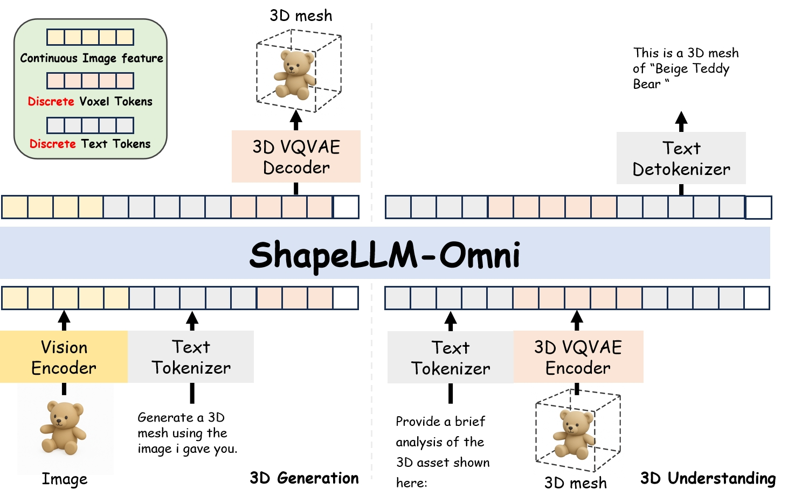
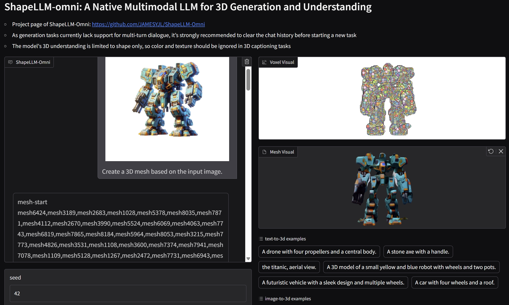

<p align="center">
  <h3 align="center"><strong>ShapeLLM-Omni: A Native Multimodal LLM for 3D Generation and Understanding</strong></h3>


<p align="center">
    <a href="https://jamesyjl.github.io/">Junliang Ye</a><sup>1,2*</sup>,
    <a href="https://thuwzy.github.io/">Zhengyi Wang</a><sup>1,2*</sup>,
    <a href="https://zhaorw02.github.io/">Ruowen Zhao</a><sup>1*</sup>,
    <a href="">Shenghao Xie</a><sup>3</sup>,
    <a href="https://ml.cs.tsinghua.edu.cn/~jun/index.shtml">Jun Zhu</a><sup>1,2†</sup>
    <br>
    <sup>*</sup>Equal Contribution.
    <br>
    <sup>†</sup>Corresponding authors.
    <br>
    <sup>1</sup>Tsinghua University,
    <sup>2</sup>ShengShu,
    <sup>3</sup>Peking University,
</p>

<div align="center">

<a href='https://arxiv.org/abs/2506.01853'></a> &nbsp;&nbsp;&nbsp;&nbsp;
 <a href='https://jamesyjl.github.io/ShapeLLM/'></a> &nbsp;&nbsp;&nbsp;&nbsp;
 <a href="https://huggingface.co/spaces/yejunliang23/ShapLLM-Omni"></a>
 &nbsp;&nbsp;&nbsp;&nbsp;
<a href="https://huggingface.co/yejunliang23/ShapeLLM-7B-omni"></a> &nbsp;&nbsp;&nbsp;&nbsp;
<a href='https://huggingface.co/datasets/yejunliang23/3D-Alpaca'>

</div>

https://github.com/user-attachments/assets/9e5bc462-5d50-4ff4-914a-9556324528c6

<p align="center">
    
</p>

## Release
- [6/03] 🔥🔥We released the pretrained weights for both **ShapeLLM-Omni** (7B) and **3DVQVAE**.
- [6/03] 🔥🔥We released 50k high-quality 3D edited data pairs.
- [6/07] 🔥🔥We built a [demo](https://huggingface.co/spaces/yejunliang23/ShapLLM-Omni) for everyone to try out.

## Installation
Please set up the Python environment following [TRELLIS](https://github.com/microsoft/TRELLIS/tree/main) and [QWEN2.5-vl](https://github.com/QwenLM/Qwen2.5-VL), or you can create by:
```
pip install -r requirements.txt
```

## Inference
We suggest using Gradio UI for visualizing inference.
```
python app.py
```
<p align="center">
    
</p>

For templates used for different tasks, please refer to the [templates.txt](https://github.com/JAMESYJL/ShapeLLM-Omni/blob/main/templates.txt)

## Qualitative result

https://github.com/user-attachments/assets/79a33188-3ef0-4702-9892-15b864710f2d

https://github.com/user-attachments/assets/43b7bc78-1bef-4b79-bbdb-edfc4ad2b8e1
  
## Important Notes
- Please refer to our [project_page](https://jamesyjl.github.io/ShapeLLM/) for more examples.
## Todo
- [ ] Release of the entire 3D-Alpaca dataset.
- [ ] Release of training code.
- [ ] Release of model weights featuring multi-turn dialogue and 3D editing capabilities.

## Acknowledgement
Our code is based on these wonderful repos:
* **[LLaMA-Factory](https://github.com/hiyouga/LLaMA-Factory)**
* **[TRELLIS](https://github.com/microsoft/TRELLIS)**
* **[PointLLM](https://github.com/OpenRobotLab/PointLLM)**
* **[Qwen2.5-VL](https://github.com/QwenLM/Qwen2.5-VL)**
* **[LLaMA-Mesh](https://github.com/nv-tlabs/LLaMA-Mesh)**

## ✍️ Citation

```bibtex
@article{ye2025shapellm,
  title={ShapeLLM-Omni: A Native Multimodal LLM for 3D Generation and Understanding},
  author={Ye, Junliang and Wang, Zhengyi and Zhao, Ruowen and Xie, Shenghao and Zhu, Jun},
  journal={arXiv preprint arXiv:2506.01853},
  year={2025}
}
```

